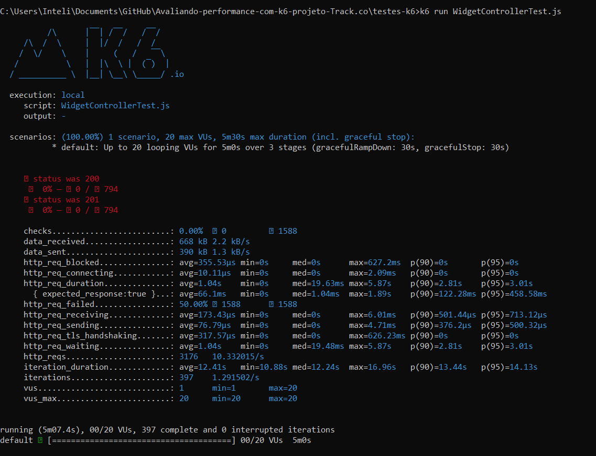

# Avaliando-performance-com-k6-projeto-Track.co

## Testes de carga com K6:

A tecnologia K6 é uma ferramenta de teste de carga que permite simular cenários de uso em APIs e back-ends para identificar limites de capacidade e pontos de falha sob cargas pesadas que simulam usuários fazendo requisições em dado endpoint. Com K6, nós, desenvolvedores podemos criar scripts de teste em JavaScript, definindo casos de teste como solicitações HTTP, pausas (para simular o comportamento do usuário real), e verificar respostas específicas do servidor. Oferece flexibilidade na simulação de diversos cenários de teste, como aumento gradual de usuários, manutenção de uma carga constante e redução gradual. Os resultados dos testes são apresentados em relatórios no proprio terminal onde se executa os teste, facilitando a identificação de problemas de desempenho e a tomada de decisões para melhorias de maneira fácil e rápida.

## Aprendizados:

Com o k6 vi a posibilidade de 

## Testes:

Para realizar os testes de carga utilizando o K6, foi configurado um cenário de teste com a seguinte estratégia de execução ao longo de 5 minutos:

```
    stages: [
        { duration: '1m', target: 20 }, 
        { duration: '3m', target: 20 }, 
        { duration: '1m', target: 0 },
    ]
```

* Aumento para 20 usuários: Durante o primeiro minuto, a carga nos endpoints é gradualmente aumentada até alcançar 20 usuários simultâneos. Este período simula um crescimento rápido na utilização para observar como o sistema se comporta sob uma pressão inicial.

* Manutenção de 20 usuários: Após atingir os 20 usuários, a carga é mantida constante por mais 3 minutos. Essa fase permite avaliar a estabilidade e o desempenho do sistema sob uma carga contínua, identificando possíveis degradações ou problemas de sustentabilidade da carga.

* Redução para 0 usuários: No último minuto, a carga é progressivamente reduzida até chegar a nenhum usuário ativo. Este período ajuda a verificar como o sistema se recupera e retorna ao estado de repouso após a cessação da carga.
  
Essa configuração oferece uma visão abrangente sobre o comportamento do sistema em diferentes níveis de carga, desde o aumento rápido, passando pela estabilidade sob uma carga constante, até a redução e recuperação pós-teste.

### Conclusão dos Resultados dos testes:



Foram realizados os testes em 4 dos 7 endpoints do projeto, são eles: "get all widgets", "get one widget by id", "post widget" e "post nps".

### Resultados HTTP:

* status 200: Houve 794 verificações para a resposta HTTP 200, o que significa que todas as solicitações GET foram bem-sucedidas.
* status 201: Houve 794 verificações para a resposta HTTP 201, indicando que todas as solicitações POST também foram bem-sucedidas.

### Performance:

* A transferência de dados recebida foi de aproximadamente 668 KB a uma taxa de 2.2 KB/s.
A transferência de dados enviada foi de aproximadamente 390 KB a uma taxa de 1.3 KB/s.
* Não houve requisições bloqueadas.
* As médias de tempo para as conexões HTTP e envio de dados foram razoavelmente rápidas.
* O tempo de espera (http_req_waiting) teve uma média de 316.04 ms, o que pode ser um ponto de atenção, pois é um indicativo do tempo de processamento no servidor.
  

### Verificações:

* A verificação expected_response:true teve uma média de 66.1ms, mostrando que a resposta esperada foi rápida e consistente.

### Conceitos Aprendidos:

Compreendi que o K6 é uma ferramenta de teste de carga que exige a criação de um arquivo específico para cada endpoint. Isso é fundamental para avaliar a capacidade de carga que cada endpoint pode suportar de forma individualizada. Caso se opte por consolidar todos os endpoints de um controlador em um único arquivo, o teste será aplicado ao módulo como um todo, e não aos endpoints isoladamente. Assim, para uma análise detalhada e precisa da resistência de cada ponto de acesso, a abordagem correta é testar cada um separadamente.
